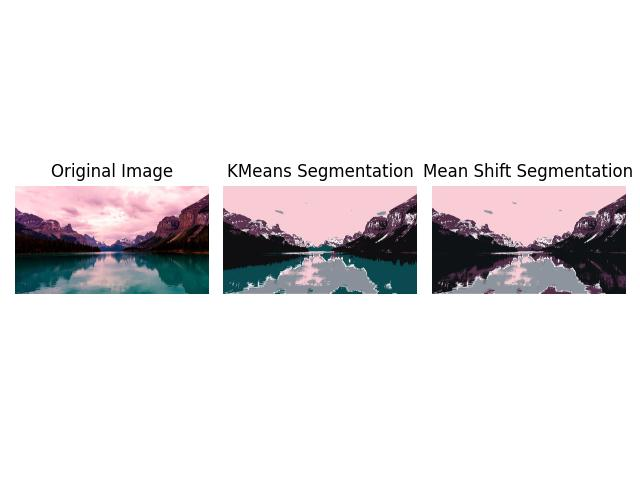

# Image Segmentation using KMeans and Mean Shift Clustering

This project demonstrates image segmentation using **KMeans** and **Mean Shift Clustering**. It segments the image into distinct regions and highlights the segmented areas by drawing boundaries around them.

## Features
- **KMeans Clustering**: Segments the image based on pixel color values.
- **Mean Shift Clustering**: Automatically determines the number of cluster for segmentation.
- **Contour Detection**: Draws boundaries around segmented regions for better visualization.

## Outputs


## Requirements
- Python 3.x
- Libraries:
    - 'numpy'
    - 'pandas'
    - 'opencv'
    - 'scikit-learn'
    - 'scikit-image'
    - 'matplotlib'

Install the dependancies using pip:
```bash
pip install numpy pandas opencv-python scikit-learn seaborn matplotlib scikit-image
```
To run the script:
```bash
python segmentation_script.py
```

